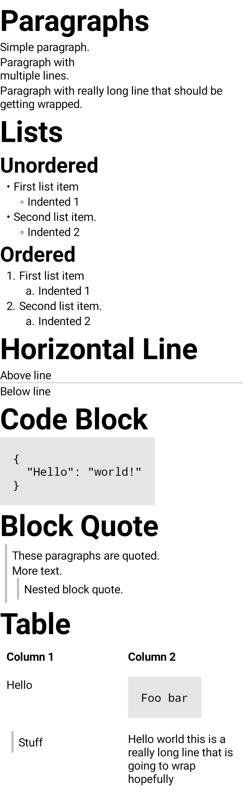

# compose-richtext

DSL for rendering fancy text with Compose.

Eventually planning to add support for rendering Markdown.

## Example

Open the `Demo.kt` file in the `richtext-ui` module to play with this.

```kotlin
RichText(modifier = DrawBackground(color = Color.White)) {
  Heading(0, "Paragraphs")
  Text("Simple paragraph.")
  Text("Paragraph with\nmultiple lines.")
  Text("Paragraph with really long line that should be getting wrapped.")

  Heading(0, "Lists")
  Heading(1, "Unordered")
  ListDemo(listType = Unordered)
  Heading(1, "Ordered")
  ListDemo(listType = Ordered)

  Heading(0, "Horizontal Line")
  Text("Above line")
  HorizontalRule()
  Text("Below line")

  Heading(0, "Code Block")
  CodeBlock(
    """
      {
        "Hello": "world!"
      }
    """.trimIndent()
  )

  Heading(0, "Block Quote")
  BlockQuote {
    Text("These paragraphs are quoted.")
    Text("More text.")
    BlockQuote {
      Text("Nested block quote.")
    }
  }

  Heading(0, "Table")
  Table(headerRow = {
    cell { Text("Column 1") }
    cell { Text("Column 2") }
  }) {
    row {
      cell { Text("Hello") }
      cell {
        CodeBlock("Foo bar")
      }
    }
    row {
      cell {
        BlockQuote {
          Text("Stuff")
        }
      }
      cell { Text("Hello world this is a really long line that is going to wrap hopefully") }
    }
  }
}
```

Looks like this:

