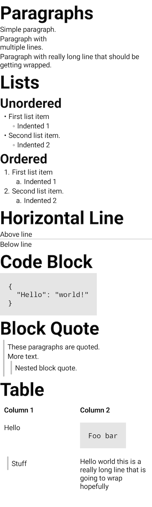

# Richtext UI

A library of composables for formatting text using higher-level concepts than are supported by
compose foundation, such as "bullet lists" and "headings".

RichText UI is a base library that is non-opinionated about higher level design requirements.
If you are already using `MaterialTheme` in your compose app, you can jump to [RichText UI Material](../richtext-ui-material/index.html)
for quick start.

## Gradle

```groovy
dependencies {
  implementation "com.halilibo.compose-richtext:richtext-ui:${richtext_version}"
}
```

## [`BasicRichText`](../api/richtext-ui/com.zachklipp.richtext.ui/-basic-rich-text.html)

Richtext UI does not depend on Material artifact of Compose. Design agnostic API allows anyone
to adopt RichText UI and its extensions like Markdown to their own design and typography systems.

If you are planning to adopt RichText within your design system, please go ahead and check out [`RichText Material`](../richtext-ui-material/index.html)
for inspiration.

## [`RichTextScope`](../api/richtext-ui/com.zachklipp.richtext.ui/-rich-text-scope/index.html)

`RichTextScope` is a context wrapper around composables that integrate and play well within RichText
content. Scope carries information about the current `TextStyle` and `ContentColor` which enables anyone
to adopt `BasicRichText` by passing their own typography in the composition tree. `ProvideTextStyle` and
`ProvideContentColor` functions also serve to pass updated text styles from RichText context to outer
design system.

RichTextScope also offers a `Default` implementation that sets up an internal design system to
easily test the library.

## Example

Open the `Demo.kt` file in the `sample` module to play with this. Although the mentioned demo
uses Material integrated version of `BasicRichText`, they share 99% of their API.

```kotlin
RichTextScope.Default.BasicRichText(
  modifier = Modifier.background(color = Color.White)
) {
  Heading(0, "Paragraphs")
  Text("Simple paragraph.")
  Text("Paragraph with\nmultiple lines.")
  Text("Paragraph with really long line that should be getting wrapped.")

  Heading(0, "Lists")
  Heading(1, "Unordered")
  ListDemo(listType = Unordered)
  Heading(1, "Ordered")
  ListDemo(listType = Ordered)

  Heading(0, "Horizontal Line")
  Text("Above line")
  HorizontalRule()
  Text("Below line")

  Heading(0, "Code Block")
  CodeBlock(
    """
      {
        "Hello": "world!"
      }
    """.trimIndent()
  )

  Heading(0, "Block Quote")
  BlockQuote {
    Text("These paragraphs are quoted.")
    Text("More text.")
    BlockQuote {
      Text("Nested block quote.")
    }
  }

  Heading(0, "Table")
  Table(headerRow = {
    cell { Text("Column 1") }
    cell { Text("Column 2") }
  }) {
    row {
      cell { Text("Hello") }
      cell {
        CodeBlock("Foo bar")
      }
    }
    row {
      cell {
        BlockQuote {
          Text("Stuff")
        }
      }
      cell { Text("Hello world this is a really long line that is going to wrap hopefully") }
    }
  }
}
```

Looks like this:


